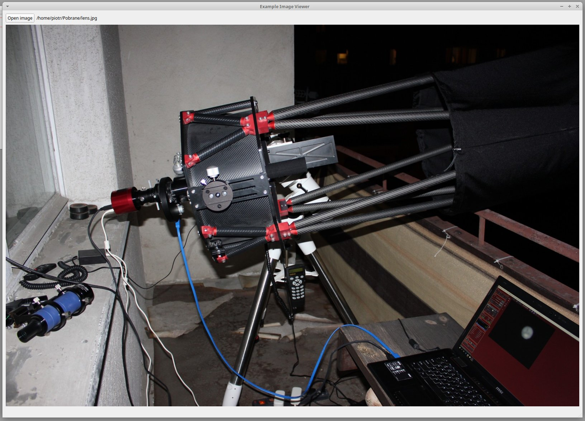

# pyqt-pyside-example
This is a basic PyQt and PySide2 example application showcasing how to work with UI files from QtDesigner
as well as signal and slots and basic widgets.

How to run
----------
Install PyQt5 and/or PySide2 - from PyPi or from system packages. I recommend making a virtualenv and installing the
`requirements.txt`

Then run the appropriate app:
* python run_pyqt.py
* python run_pyside.py

The `image_viewer_*.py` files are autogenerated from the `image_viewer.ui` and should not be modified directly.
If you want to change the UI edit the UI file and regenerate files with `pyuic5` and `pyside2-uic`.

Tests
-----
Test are managed by `pytest` and `qtbot` fixture

    python setup.py test
